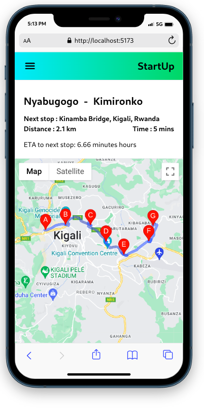
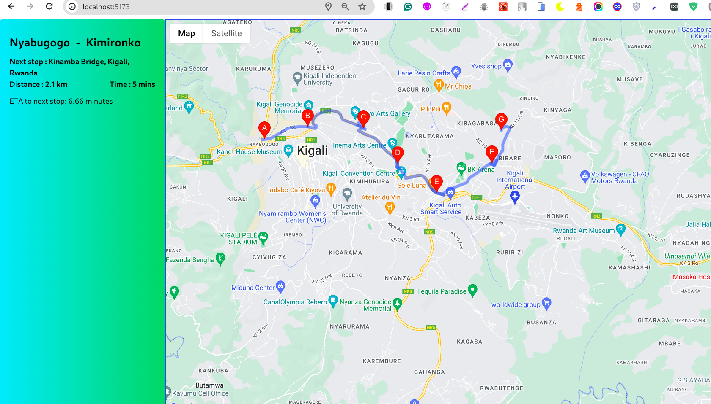

# GOOGLE_MAP_API

this project is for transportation in tracking driver's current location through route

# Technology used

- Reactjs
- Google Map API

# Feature implemente

- `Displaying the entire route with marked stops`
- `Tracking of the driver's current location`
- `Calculate and display the  ETA(Estimated Time of Arrival) for the next stop`

# How to test

- before you have to get API_KEY from google cloud console with enabled javascript map api and direction api
- Clone the repository `https://github.com/oliviertech212/google_map_api_task` and install dependencies using `npm i`
- Update `.env` file using the reference in `.env.example`
- use ` npm run dev` to start project

. Test also can be done on the deployed version
https://google-map-api-task.vercel.app/

# Small Screen

# Large Screen

